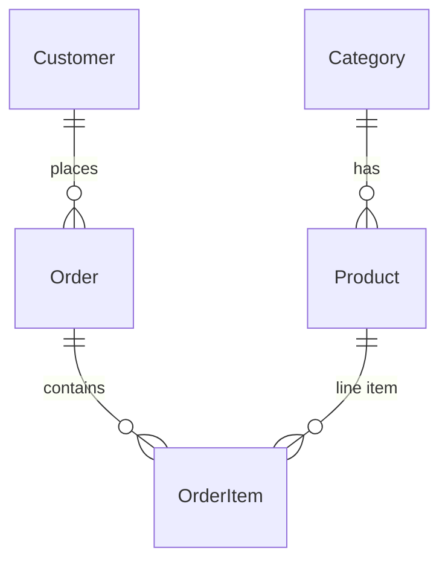

# Product & Order API

Laravel 13 JSON REST API for **products** and **orders**, with **Laravel Sanctum** bearer-token authentication, **API resources** for consistent responses, **query caching**, and **full-text search** on product `name` and `description` (via a full-text index in the products migration).

## Requirements

- **PHP** 8.3+
- **Composer**
- **Node.js / npm** — optional unless you run the full frontend dev stack (`composer run dev` uses Vite)
- A database supported by Laravel (see below)

**Full-text search:** The products table defines a full-text index on `name` and `description`. That matches **MySQL/MariaDB** usage well. The default `.env.example` uses **SQLite**; if search misbehaves on your driver, switch to MySQL/MariaDB and set `DB_*` accordingly.

## Quick start

```bash
composer install
cp .env.example .env   # or copy on Windows
php artisan key:generate
```

Configure `DB_*` in `.env`. This project sets `CACHE_STORE=database` in `.env.example`; ensure the cache table exists (Laravel ships a migration such as `create_cache_table` — run migrations).

```bash
php artisan migrate
php artisan db:seed
php artisan serve
```

API routes are prefixed with **`/api`** (e.g. `http://127.0.0.1:8000/api/login`).

## Demo credentials (seeder)

After `php artisan db:seed`:

| Field    | Value                 |
| -------- | --------------------- |
| Email    | `first_user@email.com` |
| Password | `12345678`            |

Use these only in local/demo environments; change them in production.

## Authentication

1. **Login** — `POST /api/login` with JSON body:
   - `email` (required)
   - `password` (required)
2. Response: `{ "token": "<plain-text-token>" }` on success.
3. **Protected routes:** send header `Authorization: Bearer <token>`.

Invalid credentials return **401** with `{ "error": "Invalid credentials" }`. Validation errors return **422** with Laravel’s standard error format.

Tokens are issued via Sanctum (`HasApiTokens` on the `User` model).

## API reference

All endpoints except `POST /api/login` require `auth:sanctum` (Bearer token).

### `POST /api/login`

|        | Details                                      |
| ------ | -------------------------------------------- |
| Body   | `email`, `password`                          |
| 200    | `{ "token": "..." }`                         |
| 401    | `{ "error": "Invalid credentials" }`       |
| 422    | Validation failed                            |

### `GET /api/products`

|        | Details                                                                 |
| ------ | ----------------------------------------------------------------------- |
| Query  | `page` (optional, default `1`) — paginates **10** items per page       |
| 200    | Paginated JSON API resource collection (`ProductResource`)            |

### `POST /api/products`

|        | Details                                                                 |
| ------ | ----------------------------------------------------------------------- |
| Body   | `name`, `price`, `stock`, `category_id` (see validation rules below)   |
| 201    | Created product as `ProductResource` collection (single-item wrapper)   |
| 422    | Validation failed                                                       |

Validation: `name` required string max 255; `price` required numeric ≥ 0; `stock` required integer ≥ 0; `category_id` required and must exist in `categories`.

### `GET /api/products/search`

|        | Details                                                                 |
| ------ | ----------------------------------------------------------------------- |
| Query  | `q` — full-text search term; `page` optional (10 per page)             |
| 200    | Paginated `ProductResource` collection                                   |

### `GET /api/products/dashboard`

|        | Details                                                                 |
| ------ | ----------------------------------------------------------------------- |
| 200    | JSON: `total_products`, `total_orders`, `total_revenue`, `categories` (id, name), `top_products` (by `sold_count`, top 5) |

### `GET /api/products/sales-report`

|        | Details                                                                 |
| ------ | ----------------------------------------------------------------------- |
| 200    | JSON with `summary_by_status` (per-status `order_count`, `revenue`) and `top_products_by_revenue` (top 10 from **completed** orders: `product_id`, `product_name`, `revenue`, `units_sold`) |

### `GET /api/orders`

|        | Details                                                                 |
| ------ | ----------------------------------------------------------------------- |
| Query  | `page` optional — 10 orders per page                                    |
| 200    | Paginated `OrderResource` (eager-loaded `items` → `product`, `customer`) |

### `POST /api/orders`

|        | Details                                                                 |
| ------ | ----------------------------------------------------------------------- |
| Body   | `customer_id` (must exist in `customers`), `items` non‑empty array. Each item should include `product_id` and `quantity`. |
| 201    | New order as `OrderResource` collection                                  |
| 422    | `{ "error": "Product unavailable" }` if a product is missing or stock is insufficient |
| 500    | `{ "error": "Failed" }` on unexpected failure after rollback           |

**Note:** Stock is **decremented** per line item. **`sold_count` on products is not updated** by this endpoint (it is only whatever you set in seeds or future logic).

### `GET /api/orders/filter`

|        | Details                                                                 |
| ------ | ----------------------------------------------------------------------- |
| Query  | `status` — `pending`, `completed`, or `cancelled`; `page` optional     |
| 200    | Paginated `OrderResource`                                                |

## Response shaping (resources)

- **Products:** `app/Http/Resources/ProductResource.php` — `id`, `name`, `price`, `stock`, `category` (name when loaded).
- **Orders:** `app/Http/Resources/OrderResource.php` — `id`, `customer`, `status`, `total` (`total_amount`), `items_count`, `items` (product name, quantity, prices), `created_at`.

## Middleware

- **`ForceJsonApi`** (`app/Http/Middleware/ForceJsonApi.php`) — For requests under `api/*`, sets `Accept: application/json` so API routes return JSON. Registered in `bootstrap/app.php`.
- **Sanctum** — `EnsureFrontendRequestsAreStateful` is prepended on the API stack (default Laravel + Sanctum setup).

## Data model

| Table         | Main columns |
| ------------- | ------------ |
| `categories`  | `id`, unique `name`, timestamps |
| `products`    | `id`, `name`, `description`, `price`, `stock`, `sold_count`, `category_id` (FK), full-text on `name` + `description`, timestamps |
| `customers`   | `id`, `name`, unique `email`, `phone`, timestamps |
| `orders`      | `id`, `customer_id` (FK), `status` enum (`pending` / `completed` / `cancelled`), `total_amount`, timestamps |
| `order_items` | `id`, `order_id`, `product_id`, `quantity`, `unit_price`, timestamps |

Standard Laravel `users` table is used for API login (Sanctum).



## Caching

TTLs are **60 seconds** unless noted.

| Cache key pattern              | Used for                    | TTL |
| ----------------------------- | --------------------------- | --- |
| `products.page.{page}`        | Product index               | 60s |
| `search.{q}.page.{page}`      | Product search              | 30s |
| `dashboard.data`              | Dashboard aggregates        | 60s |
| `sales.report`                | Sales report JSON           | 60s |
| `orders.page.{page}`          | Order index                 | 60s |
| `orders.status.{status}.page.{page}` | Filtered orders      | 60s |

**Invalidation (partial):** Creating a product clears `products.page.1` and `dashboard.data`. Creating an order clears `orders.page.1`, `dashboard.data`, and `sales.report`. Other pages or search keys may stay cached until they expire.

## Tests & code style

```bash
composer test
```

Runs `php artisan test`. The repo includes Breeze-related feature tests; dedicated API tests for these controllers can be added over time.

## Project layout (relevant paths)

- `routes/api.php` — API route definitions
- `app/Http/Controllers/` — `LoginController`, `ProductController`, `OrderController`
- `app/Http/Resources/` — `ProductResource`, `OrderResource`
- `app/Models/` — Eloquent models
- `database/migrations/` — schema
- `database/seeders/DatabaseSeeder.php` — demo users, categories, products, customers, orders

## License

The Laravel framework is open-sourced software licensed under the [MIT license](https://opensource.org/licenses/MIT).
